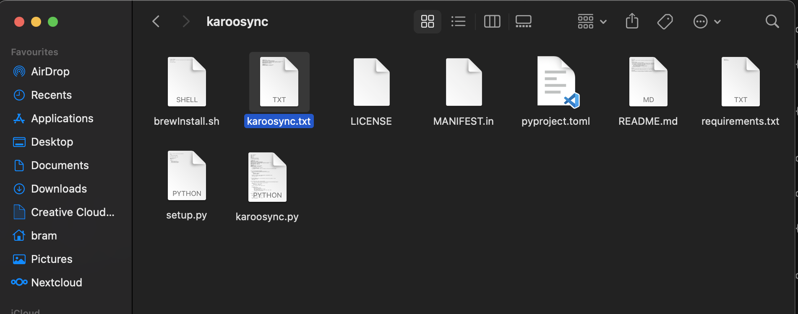

# Install (MacOS)
1. Open the terminal. (this can be done with cmd + space and searching for terminal)
2. Copy and past this command into the terminal and press enter
``` bash
/bin/bash -c "$(curl -fsSL https://raw.githubusercontent.com/Homebrew/install/HEAD/install.sh)"
```
3. Restart the terminal
4. Copy and past this command into the terminal and press enter
``` bash
brew install python git
```
5. Copy and past this command into the terminal and press enter
``` bash
cd ~/Documents
git clone https://github.com/Bramw2003/karoosync.git
cd ~/Documents/karoosync
pip3 install -r requirements.txt
```
6. Copy and past this command into the terminal and press enter
``` bash
python3 ~/Documents/karoosync/karoosync.py
```
7. A file will be create in `Documents` --> `karoosync` --> `karoosync.txt`

Open the file through finder and enter your information. Use `cmd + S` to save the config.
8. Now open the terminal again and run this command every time you want to sync your workouts
``` bash
python3 ~/Documents/karoosync/karoosync.py
```